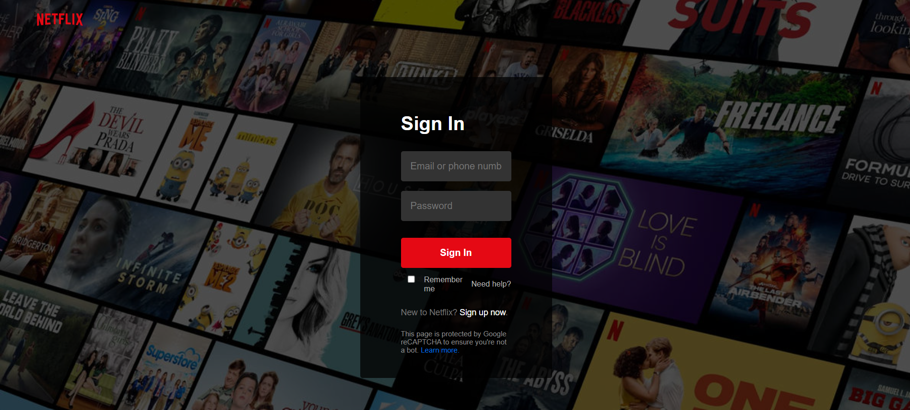
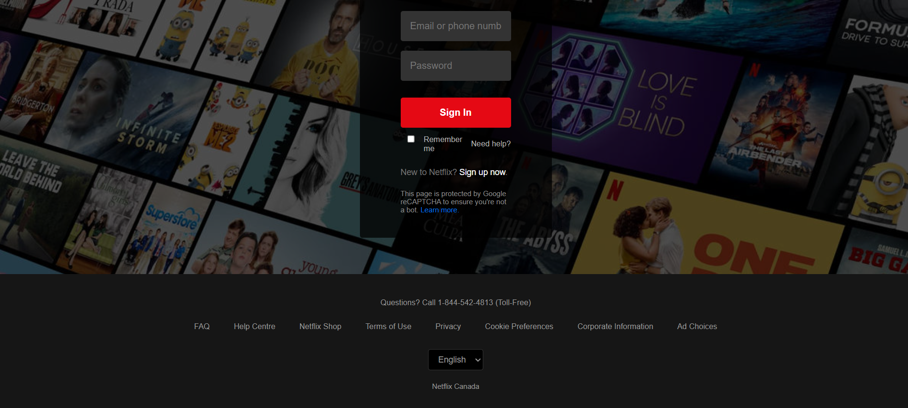

# 🎬 Netflix Homepage Replica

This is a static replica of the Netflix homepage built using only **HTML** and **CSS**.  
It's designed to demonstrate my frontend layout and styling skills.
Author-Ayush Talpada

## 🌐 Live Demo

🔗 [Click here to view it live](https://ayush-24063.github.io/netflix-homepage-replica/)

## 🌐 Screenshot

## 📁 Features

- Responsive layout
- Netflix-style banner and logo
- Styled navigation bar
- Hero section with call-to-action

## 🛠️ Built With

- HTML5
- CSS3

## 📚 What I Learned

- How to build layouts using flexbox
- How to style navbars and hero sections
- Git and GitHub basics

---

Feel free to fork or star this repo if you find it helpful!
